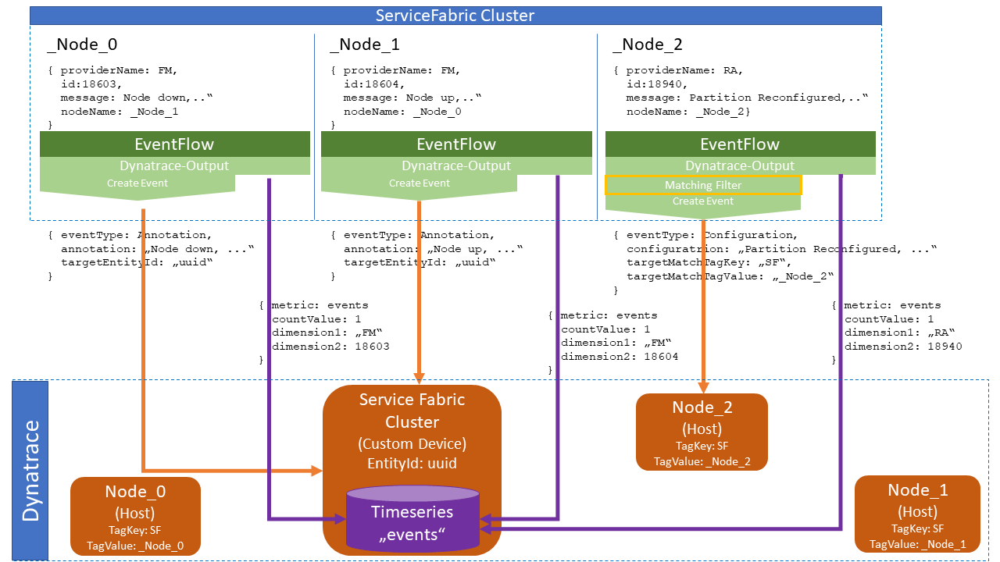
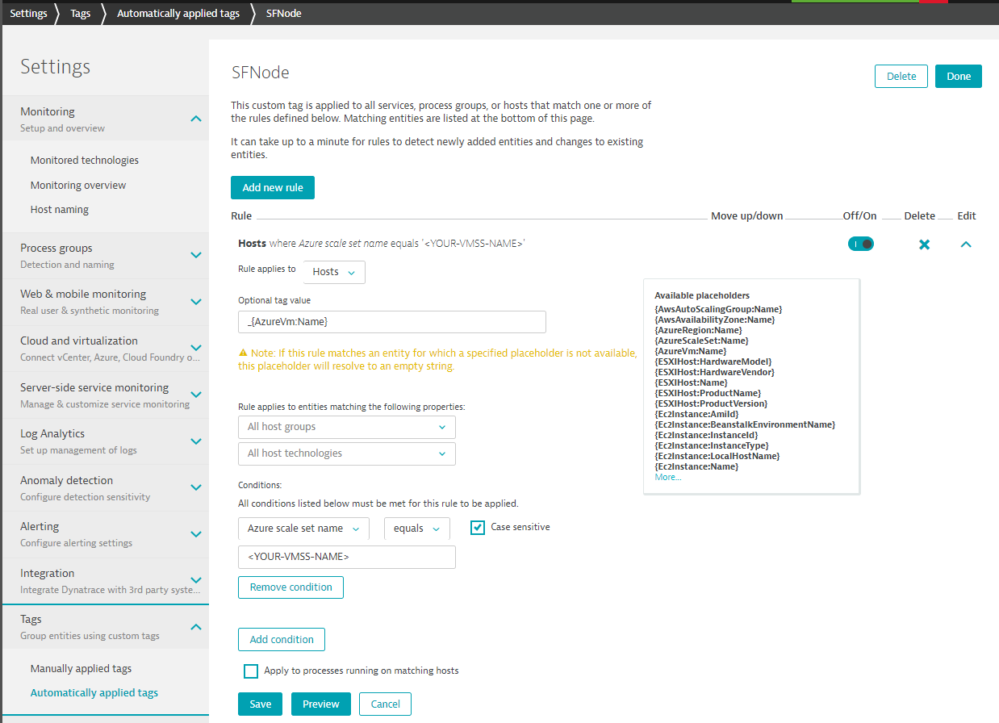
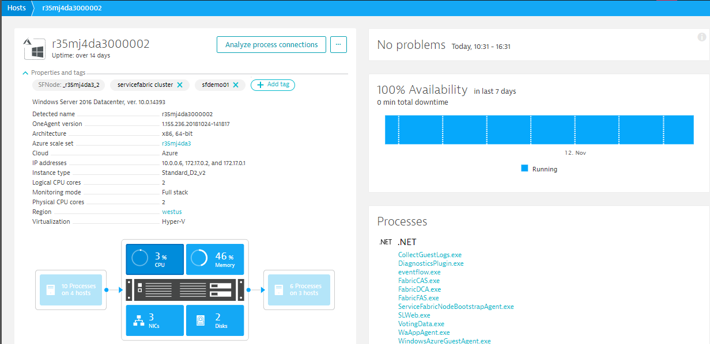
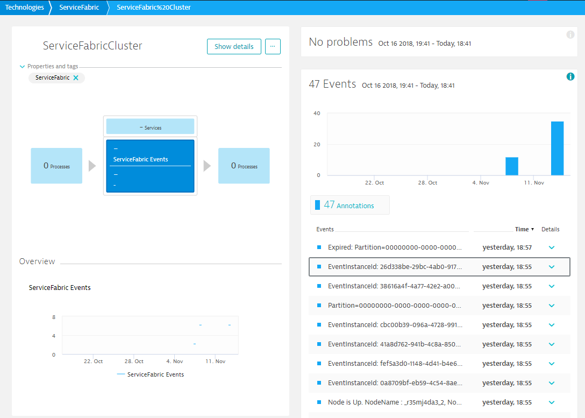
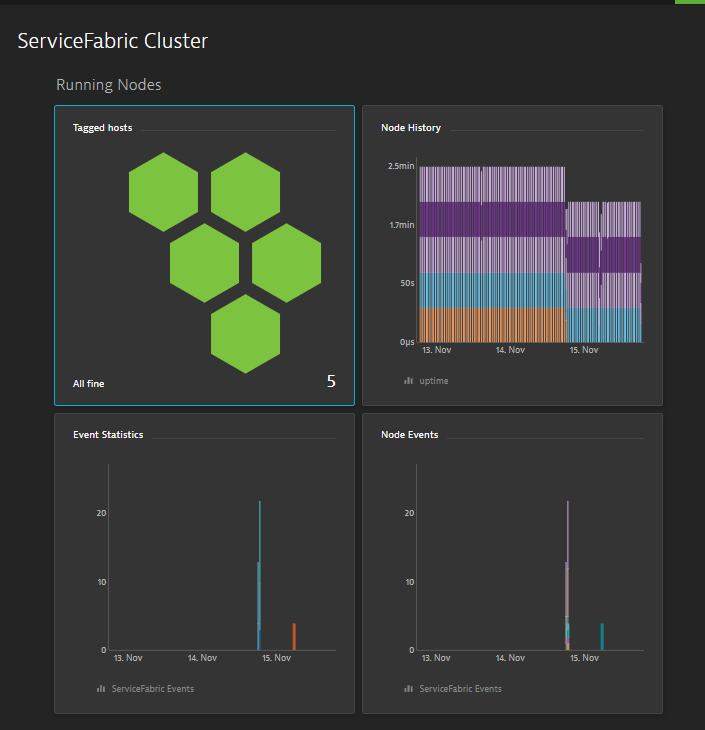

# Monitoring ServiceFabric with Dynatrace and EventFlow

## Goal 
The goal is to enrich [Dynatrace](https://www.dynatrace.com) who monitors a Service Fabric Cluster using Dynatrace [OneAgent](https://www.dynatrace.com/support/help/deploy-dynatrace/oneagent/), with ETW events exposed by Service Fabric. 

Since Dynatrace is not aware of the entity model specific for Service Fabric, it recognises the applications, services, processes, hosts by their behaviour / topology concepts that is built-in Dynatrace. E.g. network & process communication, message tracing, matching properties such as VMs part of a VMSS, ...  

### The challenges
* Capture ETW events (OneAgent currently doesn't have a generic ETW listener)
* Map ETW events to the entities in Dynatrace. 
* Some events such as e.g. node-events are not necessarily emitted on the node they refer to, which makes mapping even more difficult
* Entity information in the events do not necessarily match the "logic entitiy name". E.g. nodeName is prepended by a _ following the Azure VM Name (which is not the actual internal hostname detected) 
* Track/map cluster-wide events and metrics. e.g. cluster health event
* Dynatrace supports different kind of events (annotations, problems, configuration, .. ), requiring to propagate properties dependend on the type of the event.

## How-To push ETW events into Dynatrace
To leverage Service Fabric ETW events within Dynatrace, this project implements a ServiceFabric application using the "EventFlow library suite" to capture the ETW events and generate "Dynatrace-Events" based on the input events. 

The [EventFlow library suite](https://github.com/Azure/diagnostics-eventflow) allows applications to define what diagnostics data to collect, and where they should be outputted to. 

Dynatrace provides an [output extension for EventFlow](https://github.com/Dynatrace/diagnostics-eventflow) to push events and metrics using the Dynatrace [Rest API](https://www.dynatrace.com/support/help/dynatrace-api/). 

The provider is also capable define a monitoring entity, that either creates a [Custom Device](https://www.dynatrace.com/support/help/dynatrace-api/environment/topology-and-smartscape-api/topology-smartscape-api-custom-device/) or resolves to another entity defined in Dynatrace. For Service-Fabric we use this to create a custom device that represents the cluster entity to track cluster wide metrics and events. This entity is also the default receiving entity for events that don't match a filter which adjusts the matching rules (See below).  

Additionally a meta-data filter is provided to be able adjust events specifically to Dynatrace capabilities getting most out of the analytics capabilties. 

For example: 
* Push a health event as a problem event that immediately opens a Dynatrace Problem. 
* Push a partition re-configuration event as a "Configuration event" for enhanced information in the root-cause information. 
* Extract a specific event property such as nodeName and use it as a matching tag to map the event to the related host. 



## Setup

- [Service Fabric](https://azure.microsoft.com/en-us/services/service-fabric/) Cluster to monitor
- [Dynatrace Account](https://www.dynatrace.com/trial/)
- [Dynatrace OneAgent installed on the cluster nodes](https://www.dynatrace.com/support/help/cloud-platforms/azure/how-do-i-monitor-azure-service-fabric-applications/)
- [Stateless SF Service using eventflow to forward ETW events](#The-eventflow-service)

### The service implementing EventFlow

The service simply initializes EventFlow and listens to the cancellation token to gracefully shutdown the service. 

This is **imporant** as the opened ETW sessions will not be closed properly causing the OS running out of system resources after some process restarts.

```c#
protected override async Task RunAsync(CancellationToken cancellationToken)
{
  try
  {
    //Initialize EventFlow 
    using (DiagnosticPipeline pipeline = DiagnosticPipelineFactory.CreatePipeline("eventFlowConfig.json"))
    {
      try
      {
          //Keep the service up and running
          while (true)
          {
              //listen to cancellationToken to gracefully shutdown the service
              cancellationToken.ThrowIfCancellationRequested();

              await Task.Delay(TimeSpan.FromSeconds(1), cancellationToken);
          }
      }
      catch //catch any exception to gracefully exit the eventflow diagnosticspipeline
      {
          ServiceEventSource.Current.ServiceMessage(this.Context, "Shutdown requested");
      }
    }
  }
  catch (Exception ex) when (!cancellationToken.IsCancellationRequested)
  {
      ServiceEventSource.Current.ServiceMessage(this.Context, ex.ToString());
  }
}
```
**Note**
The full example project can be found in the subfolder *eventflow*


#### Service deployment
Configure the service to run an instance on every single ServiceFabric node by [setting the instance count to -1](https://docs.microsoft.com/en-us/azure/service-fabric/service-fabric-concepts-scalability#using-dynamic-instance-count)

**Note**
The service project can be found  subfolder *monitoring-service".


### Example Configuration

Following list describes the necessary tasks to be achieved:
* Listen to [Service Fabric platform events](https://docs.microsoft.com/en-us/azure/service-fabric/service-fabric-diagnostics-event-generation-infra), filtering out only important operational events. 
* Defining a monitoring entity in Dynatrace, that Service Fabric cluster, where we can track cluster-wide timeseries and events that we don't want to directly attach to a specific Dynatrace monitoring entity. This Entity will be the default receiver for events. 
* Setting up a mapping for events that should directly attach to it's cluster node in Dynatrace

#### Dynatrace Configuration
To map node-specific events to a Dynatrace host we create a [tag rule](https://www.dynatrace.com/support/help/monitor/tags-and-metadata/tags-and-metadata/how-do-i-define-tags/), that can be used for matching events based on given tags. 

The rule is defined as follows: 
**Create a tag `SFNode` for hosts matching Azure-VM-ScaleSet `<Your-SF-ScaleSet>` with `_`+`{Azure-VM-Name}` as tag value.**



Matching hosts are then automatically tagged: 


#### EventFlow Configuration

EventFlow is configured via a [JSON file](https://github.com/Dynatrace/diagnostics-eventflow/blob/output-dynatrace-examples/examples/ServiceFabric/eventflow/eventFlowConfig.json). To read more about configuration see [readme.md](https://github.com/Dynatrace/diagnostics-eventflow/tree/output-dynatrace)

For authenticating the Dynatrace API you need to replace/set 
`<Dynatrace API Token>` as well as `<Dynatrace Environment ID>` in the following EventFlow config

```js
{
  "healthReporter": {
    "type": "CsvHealthReporter",
    "logFileFolder": ".",
    "logFilePrefix": "HealthReport",
    "minReportLevel": "Warning",
    "throttlingPeriodMsec": "1000"
  },
  "inputs": [
    {
      /* Define ETW as input provider */
      "type": "ETW",
      "providers": [
        {
          /*Service-Fabric Platform events*/
          "providerGuid": "cbd93bc2-71e5-4566-b3a7-595d8eeca6e8",
          /* with specific keyword filter for most important operational events */
          "keywords": "4611686018427387904"
        }
      ]
    }
  ],

  "filters": [
    {
      "type": "drop",
      "include": "Level == Verbose"
    }

  ],

  "outputs": [
     {
      /* Define Dynatrace as output provider */
      "type": "Dynatrace",
      "filters": [
        {
          /* Define a metadata-filter overriding the "source" property, setting to "eventflow-ETW"*/
          "type": "metadata",
          "metadata": "dynatrace-event",
          "include": "ProviderName==Microsoft-ServiceFabric",
          "source": "eventflow-ETW"
        },
        {

          /* By default all events are sent to the default cluster entity as annotation events. With this filter we attach the partition-reconfiguration event to it's node where the re-configuraton has happend changing also the event type to a custom configuration event.
          
          The target node is not necessary the current node, but given in the event-property "nodeName". 
          
          As in Dynatrace the nodes are tagged "SFNode:<nodeName>" appropriately, we can use the "nodeName" property to map the event to the host.*/
          "type": "metadata",
          "metadata": "dynatrace-event",
          "include": "ID == 18940",
          "eventType": "CUSTOM_CONFIGURATION",
          "configurationProperty": "Message",
          "descriptionProperty": "ID",
          "tagMatchContext": "CONTEXTLESS",
          "tagMatchEntityType": "HOST",
          "tagMatchKey": "SFNode",
          "tagMatchValueProperty": "nodeName"
        }
      ],

      /*Dynatrace API credentials*/
      "APIToken": "<Dynatrace API Token>",
      "ServiceBaseAddress": "https://<Dynatrace Environment ID>.live.dynatrace.com",
      "ServiceAPIEndpoint": "/api/",

      /*We create virtual entity within Dynatrace for the Service Fabric cluster to track cluster events & metrics. All events that are not explicitly routed to other entities (see above) are tracked via this entity. For more details see https://www.dynatrace.com/support/help/dynatrace-api/environment/topology-and-smartscape-api/topology-smartscape-api-custom-device/ */ 
      "MonitoredEntity": {
        "entityAlias": "ServiceFabric-Cluster",
        "type": "ServiceFabric",
        "tags": [ "ServiceFabric" ],
        /* Link provided within Dynatrace. Potentially the link to the Service Fabric Explorer */
        "configUrl": "https://localhost:19080",
        "favicon": "https://assets.dynatrace.com/global/icons/white/icons_technologies_003_microsoft-azure-fabric.png",
        /* Events are additionally tracked within a timeseries. ETW-ProviderName is reported in the "channel"-dimension and the event-id in the "event"-dimension*/
        "Timeseries": {
          "timeseriesID": "servicefabric.events",
          "displayName": "ServiceFabric Events",
          "unit": "Count",
          "dimensions": [ "channel", "event" ],
          "types": [ "ServiceFabric" ]
        }
      }
    }
  ],
  "settings": {
    "maxEventBatchSize": "50"
  },

  "schema-version": "2016-08-11",
  /* Register Dynatrace assembly as extension for output providers */
  "extensions": [
    {
      "category": "outputFactory",
      "type": "Dynatrace",
      "qualifiedTypeName": "Microsoft.Diagnostics.EventFlow.Outputs.DynatraceOutputFactory,  Microsoft.Diagnostics.EventFlow.Outputs.Dynatrace"
    }
  ]
}

```
## Monitoring 

Having the additional event's and metrics in Dynatrace you monitor the event's flowing in on your entities e.g. the ServiceFabric Cluster entity



## Custom ServiceFabric Dashboard

In addition a [custom dashboard](https://www.dynatrace.com/support/help/monitor/dashboards/how-do-i-create-custom-dashboards/) is a good way to provide cluster insights. 

Here's some basic idea how to get started: 



* Cluster nodes & health (Tagged hosts)
* Cluster nodes deployed (Node History)
* General event statistics (Event Statistic)
* Visualize Node events such as node up/down to see node dynamics (Node events)


